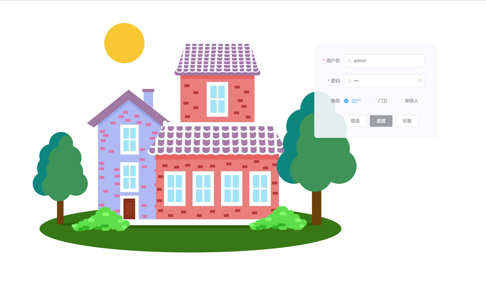
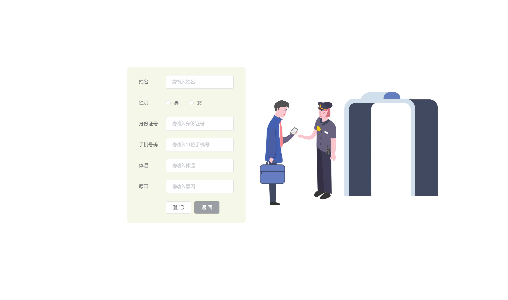
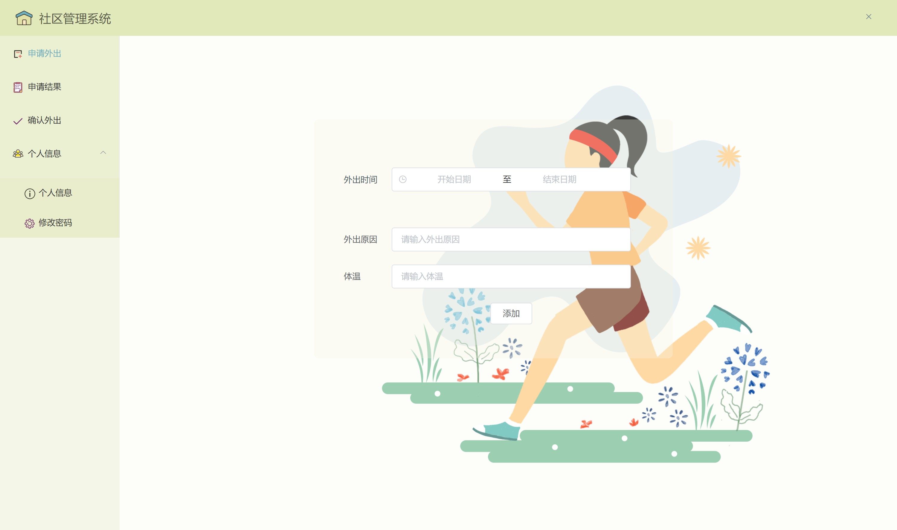
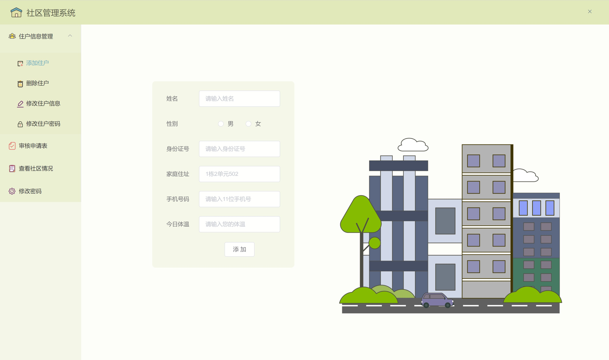

During extreme times, the totalitarian state may find various reasons to restrict the activities of the inhabitants. Once the machine starts working, tragedies will occur as both the authorities who impose regulations and the governed come to comprehend their positions.

# Web application serving the management of residents during lockdown
This application provides services to residents, gatekeepers and community managers.
1. Is a portal for residents to record health status and request to leave their house
2. Helps gatekeepers record the flow of people in and out the neighborhood
3. Helps community managers manage and add and change resident information, review residents requests, and view the flow of people

## Frontend:
- node >= 6.9.0
- npm >= 3.0.0
- vue https://vuefe.cn/v2/guide/
- element-ui@1.1.3 http://element.eleme.io/1.1/#/zh-CN/component/installation
- axios https://github.com/mzabriskie/axios
- moment http://momentjs.cn/

## Backend
- spring boot
- maven
- mybatis plus
- mysql

## preview

